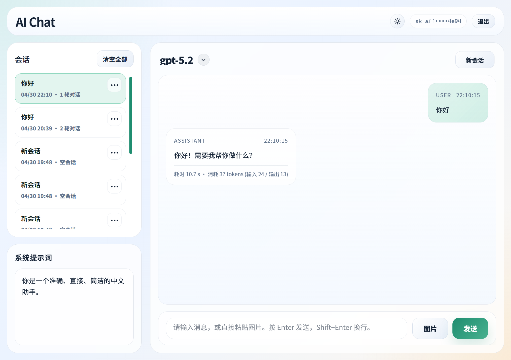
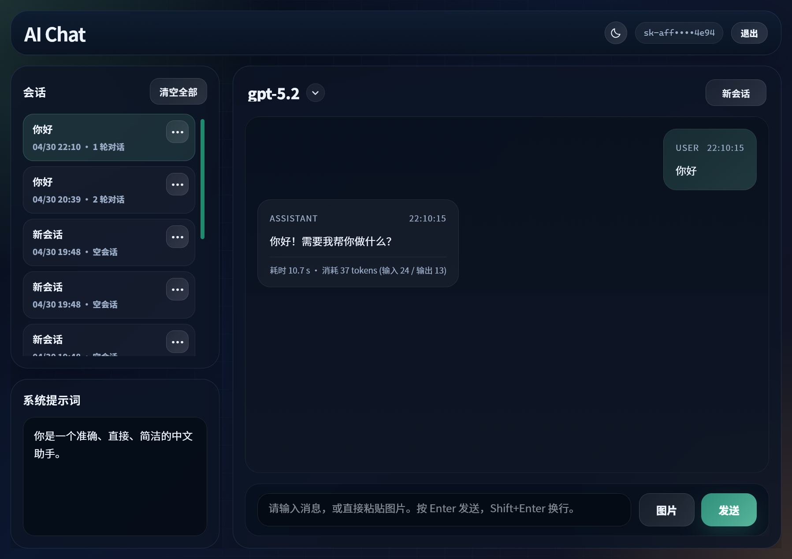
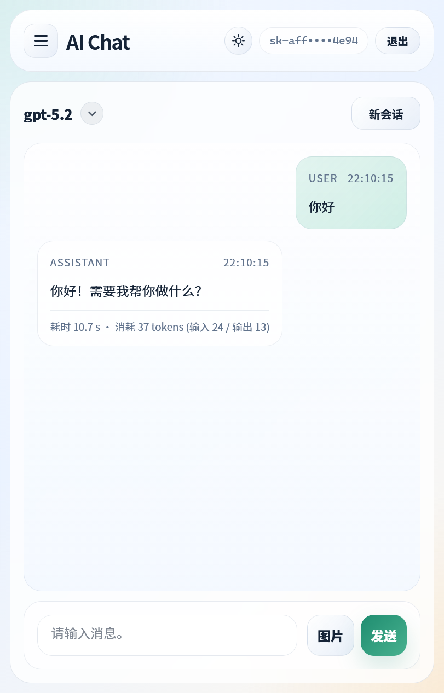
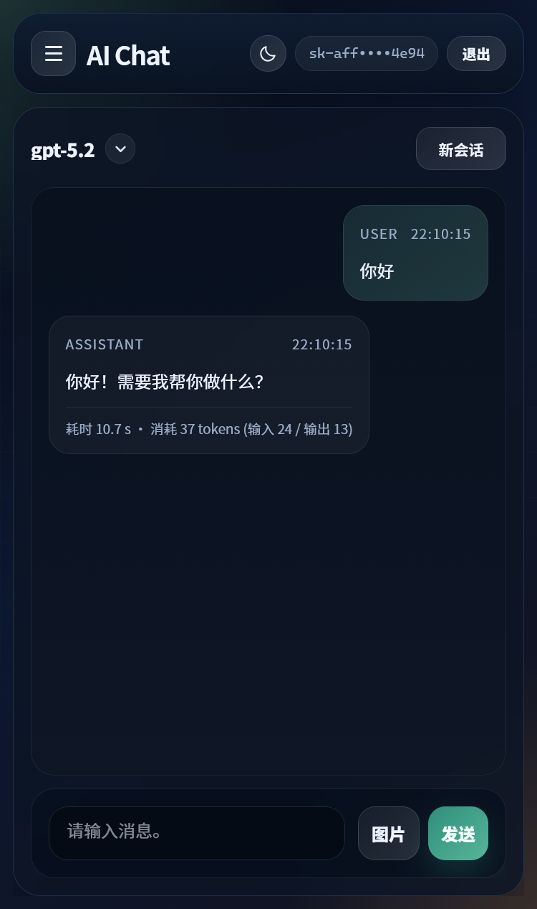
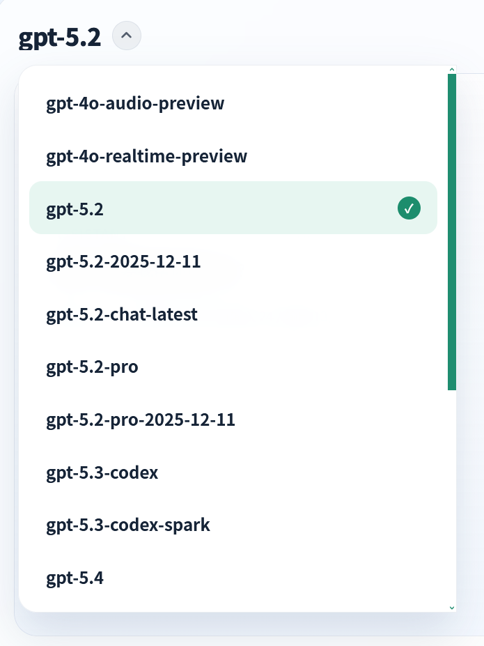

# AI Chat

一个纯前端的 OpenAI 兼容聊天页面，适合和 `sub2api` 一类网关一起部署，通过同源接口完成模型拉取、流式对话和图片消息发送。

## 功能

- API Key 登录校验，进入页面时自动拉取可用模型列表
- 模型切换，下拉选择当前会话使用的模型
- 流式输出，回复从第一个字开始逐步显示
- 多会话管理，支持新建、切换、重命名、删除和清空会话
- 会话级系统提示词，可单独保存到每个会话
- 支持上传图片、粘贴图片并随消息一起发送
- 明暗主题切换，桌面端和移动端自适应布局

## 目录说明

- [index.html](./index.html)：完整前端页面，包含样式和脚本
- [imgs](./imgs)：页面截图

## 接口要求

页面默认通过当前站点同源访问接口，也就是：

- `GET /v1/models`
- `POST /v1/responses`

其中：

- `/v1/models` 用于校验 API Key 并拉取模型列表
- `/v1/responses` 用于发送聊天请求
- 页面已支持 `text/event-stream` 流式响应

## 部署方式

这个页面不需要构建，直接作为静态文件托管即可。

1. 将 `index.html` 目录并挂载到 Nginx 的静态目录
2. 保证同一域名下 `/v1/*` 已反向代理到你的 OpenAI 兼容后端
3. 启动 Nginx 后访问即可

## 使用方式

1. 打开聊天页面
2. 输入可用的 API Key，点击“登录”
3. 选择模型
4. 输入消息后发送，或直接上传 / 粘贴图片
5. 如有需要，可在左侧修改系统提示词，或新建独立会话

## 截图

### 桌面端浅色

### 桌面端深色

### 手机端浅色

### 手机端深色

### 模型切换

## 说明

- API Key 和会话数据保存在浏览器存储中，适合个人或内部使用场景
- 页面依赖同源接口返回 OpenAI 兼容格式；其他格式可能不支持
