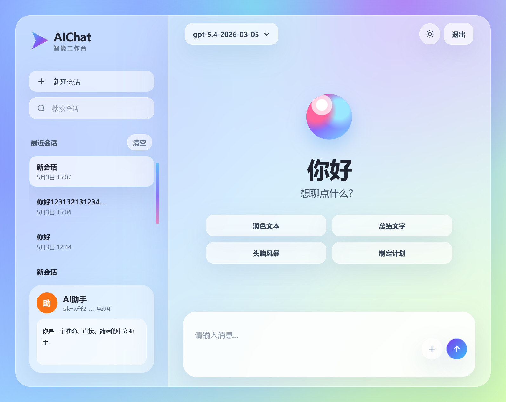
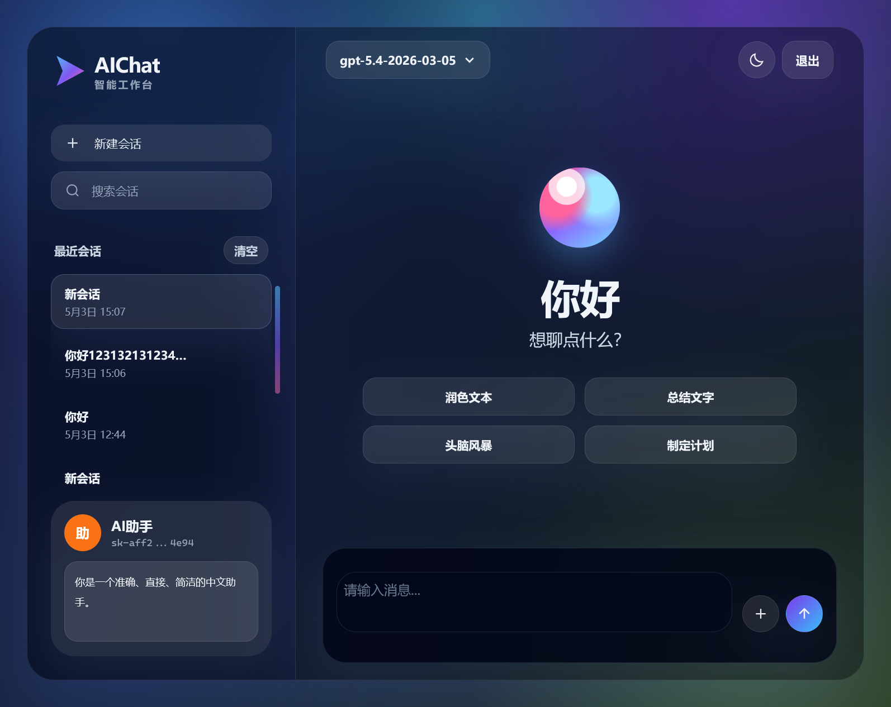
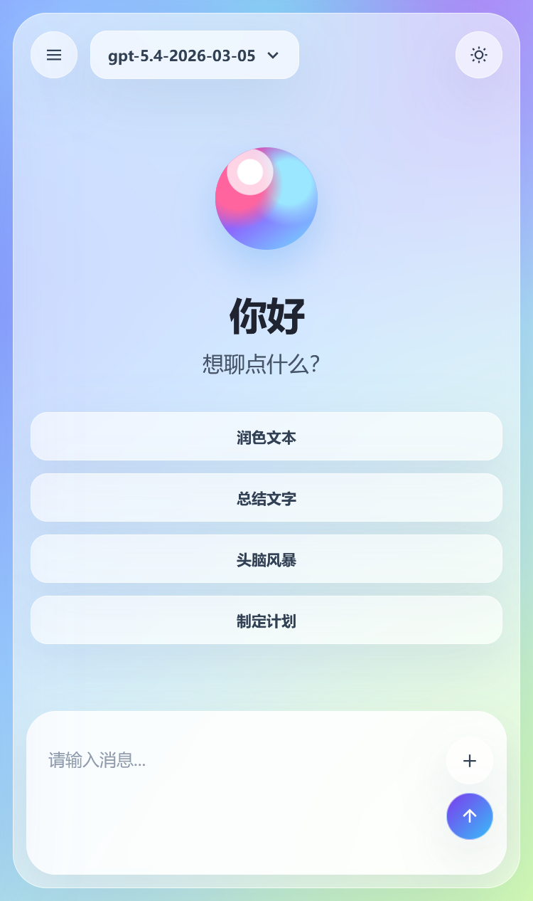
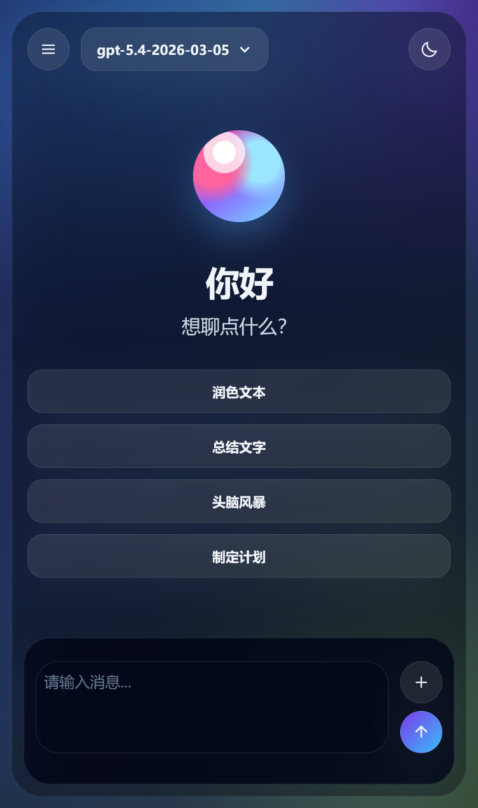

# AIChat

`AIChat` 是一个轻量级的 Web 聊天前端，源码位于 `src/` 目录中。它使用原生 HTML、JavaScript 和 Tailwind CSS 构建，登录和聊天页面分离，发布时会把可部署文件统一生成到 `src/dist/`。

页面默认请求当前站点同源接口：

```text
GET /v1/models
POST /v1/responses
```

因此部署时需要确保同一域名下已经通过后端服务或 Nginx 反向代理提供 OpenAI 兼容接口。

## 功能介绍

- 登录页和主页面分离：`login.html` 负责 token 登录，`index.html` 负责聊天。
- 登录状态守卫：未登录访问主页面会跳回登录页，已登录访问登录页会自动进入主页面。
- 本地 token 保存：登录 token 保存在当前浏览器本地，左下角会显示脱敏后的 token。
- 模型自动读取：登录时通过 `/v1/models` 校验 token，并在主页面提供模型下拉切换。
- 流式回复：通过 `/v1/responses` 获取模型回复，支持边生成边显示。
- 多会话管理：支持新建、搜索、切换、重命名、删除和清空会话。
- 会话记忆：会话内容保存在当前浏览器会话中，刷新页面后仍可继续。
- 系统提示词：左侧可以设置系统提示词，并随当前会话保存。
- 附件上传：支持上传图片和常见文档、表格、代码文件，最多 8 个附件。
- 图片粘贴：支持从剪贴板直接粘贴图片到输入框。
- 手机端输入体验：手机输入法回车会换行，电脑端 `Enter` 发送、`Shift + Enter` 换行。
- 明暗主题：支持浅色模式和暗色模式，并记住用户选择。
- 响应式布局：电脑端为左右双栏，手机端为抽屉侧边栏。
- 自定义滚动条：聊天区、会话区和输入区使用统一的简洁滚动条风格。

## 界面截图

| 桌面端浅色 | 桌面端深色 |
| --- | --- |
|  |  |

| 移动端浅色 | 移动端深色 |
| --- | --- |
|  |  |

## 目录说明

```text
AIChatHtml/
├── screenshots/            README 使用的界面截图
└── src/
    ├── index.html          主聊天页面源码
    ├── login.html          登录页面源码
    ├── css/
    │   └── input.css       Tailwind 源样式
    ├── js/
    │   ├── app.js          主页面逻辑
    │   ├── login.js        登录页逻辑
    │   └── shared.js       共享配置、主题、存储和接口工具
    ├── scripts/
    │   └── build-dist.js   发布构建脚本
    ├── dist/               发布产物，运行构建后生成
    ├── package.json        Node 脚本和依赖
    ├── package-lock.json   锁定依赖版本
    └── tailwind.config.js  Tailwind 配置
```

## 安装依赖

首次调试或构建前，先安装依赖：

```powershell
cd src
npm install
```

如果是在干净的发布环境或 CI 环境，建议使用锁文件安装：

```powershell
cd src
npm ci
```

## 调试命令

调试时建议开两个终端。

第一个终端监听 Tailwind 样式变化：

```powershell
cd src
npm run dev
```

这个命令会把 `src/css/input.css` 编译到 `src/css/styles.css`，并持续监听源码变化。

第二个终端启动静态服务：

```powershell
cd src
npx http-server . -p 5173 -c-1
```

然后在浏览器访问：

```text
http://localhost:5173/login.html
```

本地调试时如果登录失败，通常是因为 `http://localhost:5173/v1/models` 没有代理到真实后端。需要用 Nginx、网关或本地代理把 `/v1/*` 转发到 OpenAI 兼容服务。

## 发布命令

发布前在 `src/` 下生成 `dist/`：

```powershell
cd src
npm run build
```

构建脚本会执行以下事情：

- 清空旧的 `src/dist/`。
- 复制 `index.html`、`login.html` 和 `js/`。
- 使用 Tailwind 编译并压缩 CSS。
- 输出 `src/dist/css/styles.css`。

推荐的完整发布构建命令：

```powershell
cd src
npm ci
npm run build
```

构建完成后，将 `src/dist/` 目录中的文件部署到静态站点目录：

```text
src/dist/
├── index.html
├── login.html
├── css/
│   └── styles.css
└── js/
    ├── app.js
    ├── login.js
    └── shared.js
```

部署完成后确认这些路径可访问：

```text
/login.html
/index.html
/css/styles.css
/js/app.js
/js/login.js
/js/shared.js
/v1/models
/v1/responses
```
